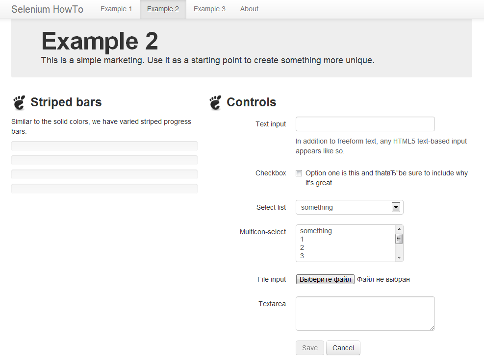

Пример 2
========

Во втором примере мы посмотрим основные компоненты управления и хранения данных. 
Зайдите на страницу "Example 2", там представлены две колонки. В правой колонке находятся управляющие элементы.
Текстовое поле, булевой флажок, выпадающий список, список с множественным выбором, компонент для выбора файла,
много-строчное текстовое поле. И две кнопки.

В левой колонке представлены 4 статус бара. Это часть, дополнительного bootstrap framework’ка,
реализованная средствами html и css. Степень заполненности управляется стилем *width*, в процентах.
Статусы увеличиваются в процессе заполнения полей. Они добавлены для наглядности.

В начале активна только кнопка *Cancel*, для сброса всех данных. *Save* активируется после заполнения всех полей,
у нее удаляется класс *disabled*. Стоит заметить, что это не настоящие кнопки, это ссылки оформленные в виде кнопок.
Обычно они либо ведут на другие страницы, как наши. Либо обрабатываются c помощью js, делая запросы на сервер и изменяя страницу.

Соответственно у нас можно выделить три дополнительных вспомогательных метода в классе *Example2Test*.
*assertButtonDisabled* для проверки что кнопка не активирована.

	assert 'disabled' in self.find(id='save').get_attribute('class')

*assertProgress* с передаваемыми параметрами *id* статус бара и числом процентов.

    sb_str = '{0}%'.format(percent)
    assert sb_str in self.find(id=id).get_attribute('style')

Есть специальный метод *value_of_css_property* для получения значения стилей,
но в нашем случае он возвращает значение в пикселях, которые непригодны.
И метод *fill_data* для заполнения всех полей данными. Его мы с начало и рассмотрим.

Все компоненты имеют уникальное имя начинающиеся с *in* плюс номер.
Например первыми строчками мы находим текстовое поле и посылаем в него набор с клавиатуры.
А так же эмулируем нажатие мышкой на флаг.

	self.find(name='in1').send_keys('Black7White')
	self.find(name='in2').click()

В следующих строках мы находим списки и оборачиваем их в специальный *Select* класс.
Выбирая из выпадающего списка опцию по его отображаемому имени.

    in3 = Select(self.find(name='in3'))
    in3.select_by_visible_text('4')

Этот вспомогательный класс предоставляет нам следующие поля и методы:

* options - все опции
* all_selected_options - все выделенные опции
* first_selected_option - первая выбранная опция
* select_by_value - выбрать по атрибуту value
* select_by_index - выбрать по индексу массива
* select_by_visible_text - выбрать по видимому тексту
* deselect_all - отметить выделение
* deselect_by_value - отменить выделение по атрибуту value
* deselect_by_index - отменить выделение по индексу массива
* deselect_by_visible_text - отменить выделение по видимому тексту

Компонент файл с точки зрения драйвера является обычным текстовым полем. Мы должны туда просто передать путь до файла.
В последнем поле мы опять передаем строку, только в данном случаем нам нужен длинный текст.
Поэтому мы умножаем слово на число, конкатенируя строку с собой 32 раза.

Рассмотрим методы проверки кнопок. *test_cancel* вызывает заполнения данных, находит кнопку отменить и эмитирует нажатие.
После проверяет что все поля пустые. Напоследок проверяет что статус бары равны нулю.
Метод *test_save* еще проще, он заполняет все поля, проверяет что кнопка активна и вызывает кнопку сохранить.
А на новой страничке проверяет вхождение слова *saved*.

Остальные методы являются вводом, очисткой отдельных полей.
И проверкой что статус бары тоже изменяются и возвращаются в исходное состояние.
Единственное надо объяснить пару строчек.

    self.find(name='in1').clear()
	assert not in2.get_attribute('checked')

Первой строкой мы очищаем поле, убирая текст. Второй мы проверяем что флаг не выбран.