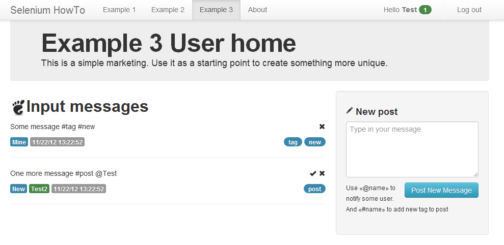

Пример 3
========

В последнем примере будет рассмотрен тестовый случай приближенный к реальному веб ресурсу.
Это небольшое приложение для ведения некоторых сообщений, как в блоге, и посылке их другим пользователям.
Идея была навеяна twitter.com. Для отправки сообщения пользователю в теле необходимо указать *@{имя пользователя}*.
Так же можно добавлять теги, *#{имя тега}*. Сообщения можно помечать как прочитанные и удалять их.
Как и у любого ресурса в примере присутствует регистрация и аутентификация.

База данных
-----------

В примере используется простое хранение данных в памяти. С реализацией сохранения объектов на диск
в виде файлов с расширениями *dump* и последующего восстановления. Для этого необходимо обратится по ссылкам
*/example3/db/dump/* */example3/db/load/* соответственно. При запуске веб сервера восстановление происходит автоматически.

В тесте мы переопределили инициализирующие методы, указанные ранее.
При запуске, данные сохраняются и база очищается. Так же при каждом новом тестовом методе хранилище заново очищается.
Соответственно каждый раз нам необходимо заново добавлять пользователей и сообщения.
После теста старые данные восстанавливаются.

Регистрация
-----------

Это форма с тремя полями: email, имя пользователя, пароль. Поля имеют некоторые ограничения,
и при несоответствии им рядом с формой появляются ошибки. Оправьте пустые поля и вы увидите их.

    self.find(id='submit').click()
    assert 'email' in self.find(id='errors').text.lower()
    assert 'username' in self.find(id='errors').text.lower()
    assert 'password' in self.find(id='errors').text.lower()

Стоит заметить что ошибки выводятся для всех полей сразу. Это позволяет пользователю поправить их сразу,
а не получать новые снова и снова, при отправке формы. Так же стоит сохранять данные в полях,
что бы клиент не перебивал их сотни раз. Проверим это.

    self.find(id='email').send_keys('email@domain.ru')
    self.find(id='username').send_keys('Keks')
    self.find(id='submit').click()
    self.assertTitle('sign up')
    assert self.find(id='email').get_attribute('value') == 'email@domain.ru'
    assert self.find(id='username').get_attribute('value') == 'Keks'

Это были простые базовые соглашения при создании веб форм.
Но нам еще необходимо проверить валидность данных вводимые в формы. Для этого мы выделили метод *assertFieldErrors*.
С параметрами *id* поля и данными для него. Поле очищается, наполняется новыми данными.
После чего форма отправляется, и в тексте с ошибками проверяется наличие имени поля.

    self.find(id=filed).clear()
    self.find(id=filed).send_keys(data)
    self.find(id='submit').click()
    self.assertTitle('sign up')
    assert filed in self.find(id='errors').text.lower()

Поле email в нашем случае может принимать текст удовлетворяющей такому регулярному выражению *^\w{3,12}@\w{2,8}\.\w{2,3}$*.
Второе поле - *^\w{3,8}$*. На поле с паролем наложено ограничение в длину, не менее 8 символов.
В тесте мы пытаемся проверить что приложение правильно реагирует на ввод неправильных данных.

    self.assertFieldErrors('email', 'email@d.s')
    self.assertFieldErrors('email', '$email%dom.ru')
    self.assertFieldErrors('email', 'email_too_long@dom.ru')
    self.assertFieldErrors('username', 'BW')
    self.assertFieldErrors('username', 'B&W')
    self.assertFieldErrors('password', '123')

Теперь когда все основные проверки выполнены можно зарегистрировать пользователя.
Но так как нам придется делать это часто в нашем примере, сделаем отдельный метод.
*registerUser* с параметрами: email, имя пользователя, пароль. Делает он следующее.
Заходит на страницу регистрации, так можно вызывать его из любого места и не боятся сохранившихся данных.
Заполняет поля. И отправляет форму.

    self.driver.get(self.base_url + '/example3/signup/')
    self.find(id='email').send_keys(email)
    self.find(id='username').send_keys(username)
    self.find(id='password').send_keys(password)
    self.find(id='submit').click()

Добавляем пользователя. И проверяем что нас пере направило на страницу входа.
Так же мы пытаемся создать еще раз этого же пользователя. Тем самым проверяя что приложение правильно реагирует.
И выдает уведомление, что такой пользователь уже существует.

    self.registerUser(self.USER_FIRST+'@ya.ru', self.USER_FIRST, self.PASSWORD)
    self.assertTitle('sign in')
    self.registerUser(self.USER_FIRST+'@ya.ru', self.USER_FIRST, self.PASSWORD)
    self.assertTitle('sign up')
    assert 'already registered' in self.find(id='errors').text.lower()

Как дополнение можно отметить следующие недочеты данного примера с регистрацией.
Одно поле для пароля, необходимо дополнительное для подтверждения. Лучше делать проверки на клиенте, через jаvascript.
И делать кнопку отправки активной, если базовые условия выполнены. Конечно должно иметь место подтверждения по email,
и соответствующая проверка этого. Проверка правильности входных данные должна быть более обширной и полной.

Аутентификация
--------------

Это форма с тремя полями: имя пользователя, пароль. Здесь нету отличий от регистрации.
Единственное, сообщение с ошибкой всего одно. В реальном приложении оно должно разделятся на неверное имя пользователя и пароль.
Так же как и с созданием нового пользователя мы сделали метод *loginUser* с двумя параметрами. Именем пользователя и паролем.

    self.driver.get(self.base_url + '/example3/login/')
    self.find(id='username').send_keys(username)
    self.find(id='password').send_keys(password)
    self.find(id='submit').click()

В этом же методе рассмотрена и обратная операция. Выход из системы. Сначала мы проверяем что мы аутентифицированы
и имя пользователя указано на панели. Затем мы эмитируем нажатие на ссылку *logout*.
После чего проверяем что блок *user-info* отсутствует.

    assert self.find(css='.user-name strong').text == self.USER_FIRST
    self.find(id='logout').click()
    assert self.find(id='user-info') is None

Добавление сообщений
--------------------

Для начала мы должны добавить пользователя и войти под ним. Зачем найти текстовое поле с id равное *post* и набрать два сообщения.
Это два первых блока, они более чем тривиальны. Далее мы сверяем что на странице присутствует два сообщения.
Теперь мы можем распаковать их в две переменные, без ошибок выполнения. Текст находим по классу *message-body* и сверяем.

    assert len(self.find_all(cls='message')) == 2
    first, second = self.find_all(cls='message-body')
    assert first.text == 'First message #tag1'
    assert second.text == 'Second message #tag1 #tag2'

Теперь нам необходимо проверить имя пользователя сообщений. В данном случае это мы сами.

    first, second = self.find_all(css='.message .user-from')
    assert first.text == 'Mine'
    assert second.text == 'Mine'

У каждого сообщения есть уникальный идентификатор вида *message* + число.
По нему мы проверим теги. Находим сообщения и берем атрибут *id*, формируем с его помощью новый запрос.
В обоих сообщениях мы сверяем количество, а потому и текст тегов.

    first, second = self.find_all(cls='message')
    css = '#{id} .tags .badge'.format(id=first.get_attribute('id'))
    assert len(self.find_all(css=css)) == 1
    assert self.find(css=css).text == 'tag1'

    css = '#{id} .tags .badge'.format(id=second.get_attribute('id'))
    assert len(self.find_all(css=css)) == 2
    tag1, tag2 = self.find_all(css=css)
    assert tag1.text == 'tag1'
    assert tag2.text == 'tag2'

Нотификации
-----------

Тут мы рассмотрим проверку передачи сообщений между пользователями. Для этого нам понадобится зарегистрировать два пользователя.
И зайти под первым. Дальше мы создаем сообщение с упоминанием второго пользователя.

    hello = 'Hello @{user}'.format(user=self.USER_SECOND)
    self.find(id='post').send_keys(hello)
    self.find(id='submit').click()
    self.find(cls='message') is not None

После добавления сообщения мы выходим из системы и входим вновь под вторым пользователем.

    self.find(id='logout').click()
    assert self.find(id='user-info') is None
    self.loginUser(self.USER_SECOND, self.PASSWORD)
    self.assertTitle('home')

Теперь мы проверяем само уведомление. Это кружок рядом с именем пользователя.
Число в кружке это количество непрочитанных сообщений от других пользователей. В нашем случае оно равно единице.
Что бы удостоверится что сообщение отображается в списке, проверим количество записей. А так же текст и отправителя.

    assert self.find(css='#user-info .badge').text == '1'
    assert len(self.find_all(cls='message')) == 1
    assert self.find(cls='message-body').text == hello
    assert self.find(css='.message .user-from').text == self.USER_FIRST

Теперь давайте пометим сообщение как прочитанное. Имитируем нажатие на галочку.
Проверяем что нотификация пропала. Но сообщение осталось.

    self.find(css='.message .icon-ok').click()
    assert self.find(css='#user-info .badge') is None
    assert len(self.find_all(cls='message')) == 1

Ну и на по следок удалим сообщение из списка, нажатием на крестик.

    self.find(css='.message .icon-remove').click()
    assert len(self.find_all(cls='message')) == 0

Это самые простые проверки. Они могут не выявить сложных ошибок.
Например посылка сообщение самому себе. И многое другое.

Приватные ссылки
----------------

На по следок стоит проверить что такой функционал как работы с сообщениями недоступен без аутентификации.
Это важный параметр безопасности веб приложения и ему стоит уделять время. Заодно проверим главную страницу на наличие кнопок.

    self.driver.get(self.base_url + '/example3/')
    self.assertTitle('example 3')
    assert len(self.find_all(cls='btn')) == 2
    assert self.find(id='user-info') is None

В нашем примере при обращение к закрытым частям, происходит пере направление на страницу входа.

    self.driver.get(self.base_url + '/example3/message/read/1/')
    self.assertTitle('sign in')
    self.driver.get(self.base_url + '/example3/message/remove/1/')
    self.assertTitle('sign in')